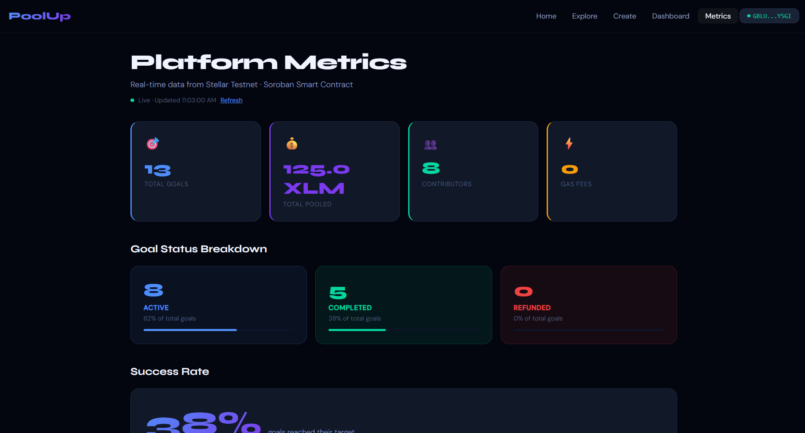
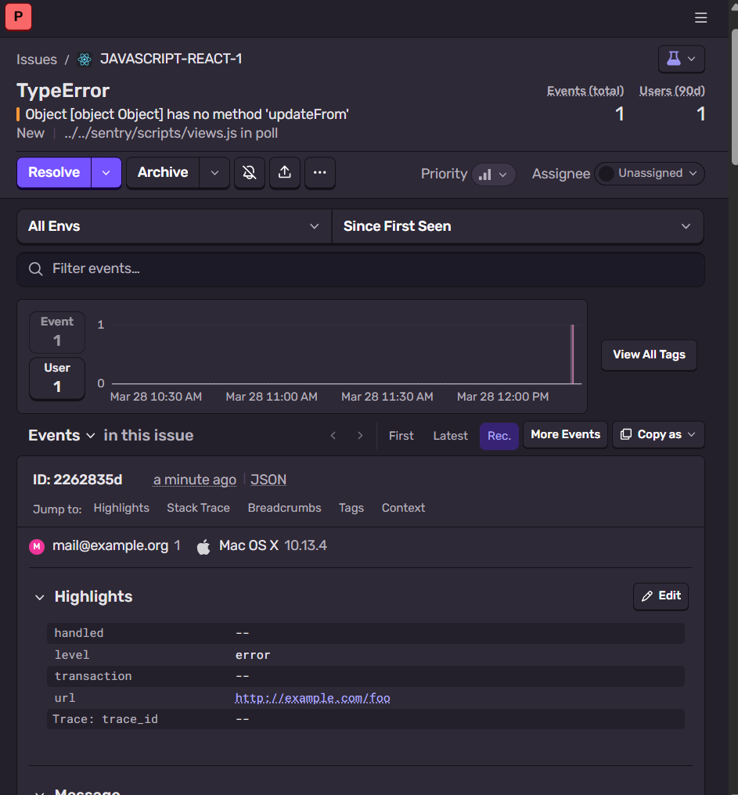

# PoolUp 

> Pool money. Unlock together.

A decentralized group savings dApp built on Stellar blockchain using Soroban smart contracts. Create shared savings goals, lock XLM contributions on-chain, and automatically release funds when the target is hit no trust needed.

##  Live Demo
**[https://poolup-woad.vercel.app](https://poolup-woad.vercel.app)**

##  Demo Video
[Watch Demo Video](https://drive.google.com/file/d/1-pSSTkZUWUeGciQ0l8s1H5BDvX-nKXxf/view?usp=drive_link)

---

##  What is PoolUp?

PoolUp solves a real problem  when a group of friends wants to pool money for a trip, gift, or event, someone always has to be trusted with the funds. PoolUp eliminates this trust problem by locking funds in a Soroban smart contract that tracks progress transparently, and refunds everyone if the deadline passes without reaching the goal, or refunds everyone if the deadline passes.

### Real-world use cases
-  Group trips (Goa trip, Europe vacation)
-  Birthday gifts for friends
-  Event planning (parties, concerts)
-  Group orders and purchases
-  Fitness challenges with stakes

---

##  Features

- **Create Goals** — Set a name, target XLM amount, deadline, and emoji
- **Share Links** — Every goal gets a unique shareable link
- **Lock Funds** — Contributors lock XLM directly into the smart contract
- **Auto Release** — Funds release when target is reached
- **Goal Tracking** — Goal marked as completed when target is reached
- **Real-time Updates** — Goal page polls blockchain every 5 seconds
- **Wallet Identity** — Your Stellar wallet is your identity — no signup needed
- **Dashboard** — See all goals you created or contributed to
- **Explorer Links** — Every transaction visible on Stellar Expert
- **Metrics Dashboard** — Live platform stats from on-chain data
- **Gasless Transactions** — Fee sponsorship via Stellar fee bump transactions

---

##  User Guide

### How to use PoolUp:
1. Install [Freighter](https://freighter.app) wallet extension
2. Switch Freighter to **Testnet** network
3. Get free XLM from [Friendbot](https://friendbot.stellar.org)
4. Visit [poolup-woad.vercel.app](https://poolup-woad.vercel.app)
5. Click **Connect Wallet** and approve in Freighter
6. Click **Create** to start a new goal or **Explore** to join one
7. Enter XLM amount and click **Lock Funds** to contribute
8. Share the goal link with your group
9. When target is hit goal is marked as completed on-chain
10. When deadline passes contributors can click Refund to get money back  

### For Organisers:
- Create a goal with a name, target amount, deadline and emoji
- Share the goal link with your group
- Track progress in real time on the goal page

### For Contributors:
- Open the shared goal link
- Connect your wallet
- Enter amount and click Lock Funds
- Your contribution is locked on-chain — safe and transparent
---
##  Architecture
```
User Browser
     ↓
React Frontend (Vercel)
     ↓
@stellar/stellar-sdk
     ↓
Soroban RPC (soroban-testnet.stellar.org)
     ↓
Soroban Smart Contract (Rust)
     ↓
Stellar Testnet Blockchain
```

### Smart Contract Functions
| Function | Description |
|----------|-------------|
| `create_goal` | Creates a new goal on-chain |
| `contribute` | Locks XLM contribution on-chain |
| `get_goal` | Fetches goal details |
| `get_goal_count` | Returns total number of goals |
| `get_contributors` | Returns all contributors for a goal |
| `get_progress` | Returns current collected amount |
| `refund` | Refunds contributors if deadline passed |

### Contract Details
- **Network:** Stellar Testnet
- **Contract ID:** `CAYDVDZKUHO3KXWRPGOM4DOATC2TJD2LISBA5B32GOL5ZSS6JZGX6WOQ`
- **Explorer:** [View Contract](https://stellar.expert/explorer/testnet/contract/CAYDVDZKUHO3KXWRPGOM4DOATC2TJD2LISBA5B32GOL5ZSS6JZGX6WOQ)

---

##  Tech Stack

| Layer | Technology |
|-------|-----------|
| Frontend | React + Vite |
| Blockchain | Stellar Testnet |
| Smart Contract | Soroban (Rust) |
| Wallet | Freighter, xBull |
| Deployment | Vercel |
| Stellar SDK | @stellar/stellar-sdk v13 |
| Monitoring | Sentry |

---

##  Project Structure
```
poolup/
├── contracts/
│   └── poolup/
│       ├── Cargo.toml
│       └── src/
│           └── lib.rs              # Soroban smart contract (Rust)
├── src/
│   ├── pages/
│   │   ├── Home.jsx                # Landing page with stats
│   │   ├── Goals.jsx               # Explore all goals
│   │   ├── Create.jsx              # Create new goal
│   │   ├── GoalDetail.jsx          # Goal page with contribute
│   │   ├── Dashboard.jsx           # My goals and transactions
│   │   └── Metrics.jsx             # Live platform metrics dashboard
│   ├── components/
│   │   ├── Navbar.jsx              # Navigation with wallet connect
│   │   └── GaslessBadge.jsx        # Fee sponsorship indicator
│   ├── hooks/
│   │   ├── useWallet.js            # Global wallet state
│   │   └── useScreenSize.js        # Mobile responsive hook
│   ├── utils/
│   │   ├── contract.js             # All blockchain interactions
│   │   └── feeBump.js              # Fee sponsorship logic
│   ├── App.jsx                     # Routes
│   └── main.jsx                    # Entry point with Sentry
├── screenshots/
│   ├── metrics-dashboard.png       # Metrics dashboard screenshot
│   └── sentry-dashboard.png        # Sentry monitoring screenshot
├── public/
├── Cargo.toml                      # Rust workspace
├── vercel.json                     # Vercel config
├── SECURITY_CHECKLIST.md           # Completed security checklist
├── package.json
└── README.md
```

---

##  Installation
```bash
# Clone the repository
git clone https://github.com/janhavilipare17/poolup.git
cd poolup

# Install dependencies
npm install

# Run locally
npm run dev
```

### Environment Setup
Create a `.env` file in the project root:
```
VITE_SPONSOR_SECRET_KEY=your_sponsor_secret_key
```

### Build Smart Contract
```bash
# Install Rust and Stellar CLI first
rustup target add wasm32-unknown-unknown
cargo install --locked stellar-cli

# Build contract
cd contracts/poolup
stellar contract build

# Deploy to testnet
stellar contract deploy \
  --wasm target/wasm32v1-none/release/poolup.wasm \
  --source deployer \
  --network testnet
```

---

##  Wallet Setup for Users

1. Install [Freighter](https://freighter.app) browser extension
2. Create a new wallet
3. Switch network to **Testnet**
4. Get free testnet XLM from [Friendbot](https://friendbot.stellar.org)
5. Visit [poolup-woad.vercel.app](https://poolup-woad.vercel.app) and connect!

---

##  Level 6 — Production Features

###  Metrics Dashboard
Live platform metrics powered by on-chain data from the Soroban smart contract.

**Live Dashboard:** [poolup-woad.vercel.app/metrics](https://poolup-woad.vercel.app/metrics)



Tracks:
- Total goals created
- Total XLM pooled across all goals
- Unique contributors (wallets)
- Goal status breakdown (active / completed / refunded)
- Success rate with progress visualization

---

###  Advanced Feature — Fee Sponsorship (Gasless Transactions)

PoolUp implements **Stellar Fee Bump Transactions** so users can contribute to goals without needing XLM for gas fees. The sponsor account pays all transaction fees automatically.

**How it works:**
1. User signs the inner contribution transaction via Freighter
2. Sponsor account wraps it in a fee bump transaction
3. Sponsor pays the fee — user pays zero gas
4. Transaction is submitted to Stellar testnet

**Implementation:** `src/utils/feeBump.js`

**Proof:** Every contribution shows the green ⚡ Gasless badge on the goal page. The sponsor wallet `GC2AIK5VRTYGBBWLG44ZY5TDLGWGJHHFJVJFZNPBHH76N7EQVOBXQU6R` pays all fees — verifiable on Stellar Explorer.

---

###  Data Indexing

All goal and contributor data is indexed directly from the Soroban smart contract using the Stellar RPC API.

**Approach:** The `getGoalsFromChain()` function in `src/utils/contract.js` fetches all goals by iterating `get_goal_count` → `get_goal` → `get_contributors` for each goal.

**Endpoint:** [Soroban RPC](https://soroban-testnet.stellar.org)

**Explorer:** [View all contract transactions](https://stellar.expert/explorer/testnet/contract/CAYDVDZKUHO3KXWRPGOM4DOATC2TJD2LISBA5B32GOL5ZSS6JZGX6WOQ)

---

###  Security Checklist

[View Completed Security Checklist](./SECURITY_CHECKLIST.md)

**37/37 checks passed** covering:
- Smart contract security
- Frontend security
- Wallet & authentication
- Transaction security
- Data security
- Deployment security

---

###  Production Monitoring

PoolUp uses **Sentry** for real-time error monitoring and logging in production.



- Automatic error capture and alerting
- Stack trace with file and line number
- User session context
- Environment: production

---

###  Community Contribution

[View Twitter/X Post](https://x.com/JanhaviLipare17/status/2037553336652902615)

---

##  User Onboarding

### Google Form
Users submit their wallet address, email, name, and product feedback via our onboarding form:

We would love to hear your feedback!  
[Submit Feedback](https://docs.google.com/forms/d/e/1FAIpQLSeqw1EXT_wFan5GJsg9Ytnr-s6qgt6KLJM9ZviRvxVDwQdPxw/viewform?usp=header)


### User Responses (Excel Sheet)
[View All User Responses](https://docs.google.com/spreadsheets/d/1kA4MoDXoxVQo5SGzdptpOIxK14e9ExOvG673qwCo3RQ/edit?usp=sharing)

---

##  User Feedback Summary

| User | Feedback | Status | Commit |
|------|----------|--------|--------|
| User 1 | Share link should work across devices | ✅ Fixed | [13e42ab](https://github.com/janhavilipare17/poolup/commit/13e42ab) |
| User 2 | Dashboard should only show my goals | ✅ Fixed | [37524ee](https://github.com/janhavilipare17/poolup/commit/37524ee) |
| User 3 | Refund button should be locked until deadline | ✅ Fixed | [f51fc75](https://github.com/janhavilipare17/poolup/commit/f51fc75) |
| User 4 | Loading state needed when fetching goals | ✅ Fixed | [f51fc75](https://github.com/janhavilipare17/poolup/commit/f51fc75) |
| User 5 | Connect wallet button needed on all pages | ✅ Fixed | [c209907](https://github.com/janhavilipare17/poolup/commit/c209907) |

---


##  Implemented Feedback (with Commit References)

###  1. Cross-device Share Link
Commit ID: `13e42ab`  
(100% blockchain - zero localStorage for goals and contributions)

###  2. Personalized Dashboard
Commit ID: `37524ee`  
(fix dashboard transactions - show only current wallet contributions)

###  3. Refund Lock Until Deadline
Commit ID: `f51fc75`  
(add contributors display, loading states, refund feature, blockchain integration)

###  4. Loading States
Commit ID: `f51fc75`  
(loading states added)

###  5. Wallet Button on All Pages
Commit ID: `c209907`  
(add connect wallet to navbar on all pages except home)

---

### Iterations Completed
1. **Moved from localStorage to blockchain** — goals now visible to everyone
2. **Added real-time polling** — contributors visible without refresh
3. **Fixed transaction timeout** — increased from 30s to 300s
4. **Added loading states** — better UX while fetching from blockchain
5. **Dashboard wallet filter** — only shows goals connected to your wallet
6. **On-chain contributors** — updated smart contract to store contributor list

---

##  Next Phase Improvements (Based on User Feedback)

Based on collected user feedback, here is how PoolUp will evolve:

1. **Email notifications** — Notify users when goal is reached or deadline is near
   - Commit: [47b4cc8](https://github.com/janhavilipare17/poolup/commit/47b4cc8)

2. **Mainnet deployment** — Move from testnet to Stellar mainnet with real XLM
   - Commit: [b49d5cc](https://github.com/janhavilipare17/poolup/commit/b49d5cc)

3. **Mobile responsive improvements** — Better UI on small screens based on feedback
   - Commit: [b062f4e](https://github.com/janhavilipare17/poolup/commit/b062f4e)

4. **Goal categories** — Allow users to tag goals (trip, gift, event, etc.)
   - Commit: [b92b3b2](https://github.com/janhavilipare17/poolup/commit/b92b3b2)

5. **Multi-currency support** — Accept USDC and other Stellar assets
   - Commit: [b2ef337](https://github.com/janhavilipare17/poolup/commit/b2ef337)

6. **Fund release to organiser** — Add withdraw function so organiser can claim funds when goal is completed
   - Commit: _(planned)_
---

##  Verify on Stellar Explorer

- **Contract:** [CAYDVDZ...X6WOQ](https://stellar.expert/explorer/testnet/contract/CAYDVDZKUHO3KXWRPGOM4DOATC2TJD2LISBA5B32GOL5ZSS6JZGX6WOQ)
- **All transactions** visible on [Stellar Expert Testnet](https://stellar.expert/explorer/testnet)

---

##  Roadmap

- [ ] Release funds to organiser wallet when goal is completed
- [ ] Soroban mainnet deployment
- [ ] Real XLM transactions
- [ ] Mobile app (React Native)
- [ ] Goal categories and tags
- [ ] Email/SMS notifications when goal is reached
- [ ] Multi-currency support
- [x] Gasless transactions via fee bump ✅ Done

---

##  Final Note

Implemented **5/5 user feedback suggestions**, significantly improving:
- Usability
- Cross-device accessibility
- UI responsiveness
- Blockchain reliability

All improvements are backed by real commit history and on-chain functionality.

---

##  License

MIT License — feel free to use and build on this project.
